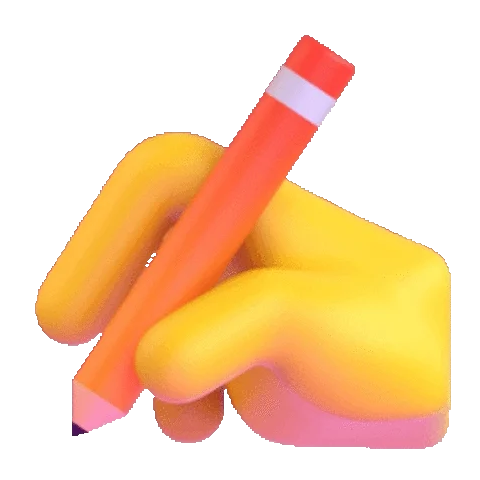

<!--

-->
<h1 align="center">Hi , I'm Sharafath Ahammed V</h1>

##  About Me

- 👨‍💻 I’m currently Studing on a school.
- 🤝 I’m open to collaborate on Open Source Projects.
- 🌱 I’m currently learning React.
- 📧 How to [reach me: ](mailto:sharafathahammed112@gmail.com)
- ⚡ Fun fact: I enjoy playing games. I enjoy watching movies
 

## 👀 Views and   Followers
 

  
    
  

 

##  Badges

<!--##  Socials

  
  
  

 -->

## 📫 Get in Touch

-  
-  
-  
-  

 

##  Languages and Tools

 
  
  
  
  <!---->
  <!---->
  
  <!---->
  
  <!---->
  <!---->
  <!---->
  <!---->
  <!---->
  
  
  <!---->
  <!-- Add more icons for your tools -->

 

##  GitHub Stats

   
   
  

##  GitHub Trophies

  

### 🔝 Top Contributed Repo

---

 

##  Random Dev Quote

>

## 😂  Dev Meme

 

---

 

## Loved this work? 

   [Give a star to this project](https://github.com/sharafath07/sharafath07)  
   [Follow me on GitHub](https://github.com/sharafath07) 

#### Feel free to reach out if you're looking for someone to collaborate on projects!.  

 

**Keep coding and stay curious!** 🚀

   

### Thanks for visiting! 🥰

  ## 💰 You can help me by Donating
    
  

---
